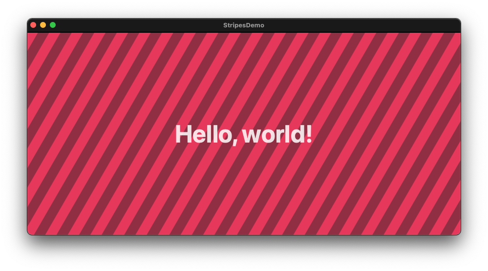
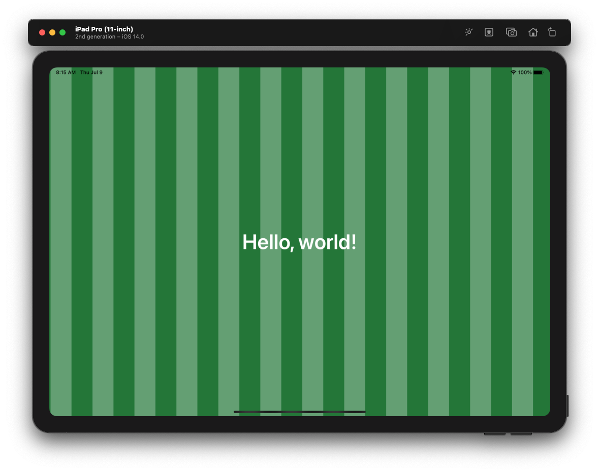
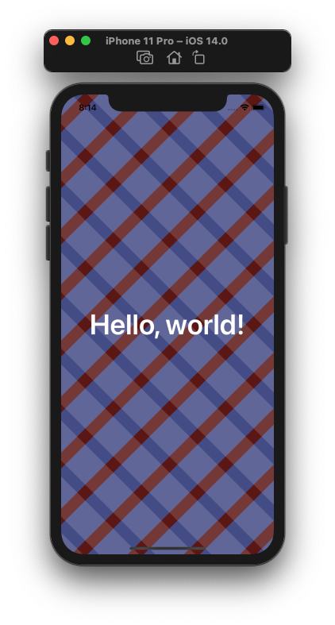
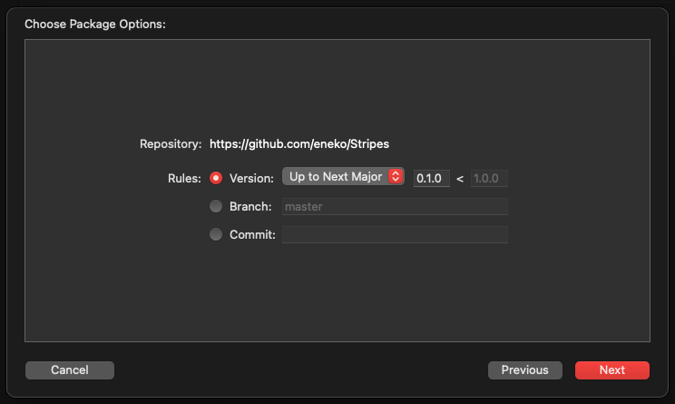

# Stripes

Beautiful background pattern views for SwiftUI. 



## Example Patterns

### Vertical Bars


### Overlapping Patterns



## Usage

```swift
import SwiftUI
import Stripes

struct ContentView: View {
    var body: some View {
        ZStack {
            Stripes(config: .default)
            Text("Hello, world!")
                .font(.system(size: 50))
                .bold()
        }
        .frame(maxWidth: .infinity, maxHeight: .infinity)
    }
}
```

## Installation

### Preferred: Add package to Xcode project

1. In Xcode, tap on `File -> Swift Packages -> Add Package Dependency`

1. Enter the package URL `https://github.com/eneko/Stripes`

    

1. Ensure the library is added to the list of Frameworks & Libraries 

    

